# Credit Risk Prediction — Phân tích & Dự đoán Rủi ro Vỡ Nợ Tín Dụng

[](https://www.python.org/)
[](https://pandas.pydata.org/)
[](https://scikit-learn.org/)
[](https://xgboost.ai/)
[](https://streamlit.io/)

> **Đồ án Chuyên ngành Khoa học Dữ liệu** — Xây dựng luồng xử lý dữ liệu, huấn luyện mô hình Ensemble Learning để dự đoán rủi ro vỡ nợ tín dụng và triển khai ứng dụng web dự đoán thời gian thực bằng Streamlit.

---

## Thông tin nhóm

| | |
|---|---|
| **Sinh viên 1** | Nguyễn Huỳnh Nhã Phương – MSSV: 2311556977 |
| **Sinh viên 2** | Hứa Thị Dĩa – MSSV: 2311557026 |
| **Giảng viên hướng dẫn** | ThS. Nguyễn Huỳnh Thông |
| **Trường / Khoa** | Đại học Nguyễn Tất Thành – Khoa Công nghệ Thông tin |
| **Chuyên ngành / Lớp** | Khoa học Dữ liệu – 23DTH2A |
| **Môn học** | Đồ án Chuyên ngành |

---

## 1. Tổng quan dự án

Trong lĩnh vực tài chính – ngân hàng, việc thẩm định nguy cơ khách hàng không trả được nợ là bài toán then chốt trong quản trị rủi ro tín dụng. Dự án thực hiện:

- Phân tích và xử lý tập dữ liệu **Credit Risk Dataset** (Kaggle) gồm **32.581 bản ghi** và **12 đặc trưng** tài chính cá nhân.
- Xử lý các vấn đề thực tế của dữ liệu thô: dữ liệu khuyết thiếu (*missing values*), giá trị ngoại lai (*outliers* — ví dụ tuổi > 80, thâm niên làm việc > 60 năm) và mất cân bằng nhãn (*imbalanced classes*: ~78.2% không vỡ nợ vs ~21.8% vỡ nợ).
- Chuẩn hóa luồng tiền xử lý (Label Encoding, StandardScaler) và huấn luyện, so sánh các mô hình Ensemble Learning: **Random Forest, Gradient Boosting, XGBoost**.
- Tối ưu hóa mô hình bằng **Hyperparameter Tuning** (RandomizedSearchCV / GridSearchCV).
- Đóng gói mô hình tốt nhất thành ứng dụng web dự đoán thời gian thực bằng **Streamlit**.

---

## 2. Kiến trúc luồng xử lý dữ liệu

```
[ Dữ liệu CSV thô ]
        │
        ▼
[ Khám phá dữ liệu (EDA) ]  ──►  Phân phối, Boxplot, Ma trận tương quan
        │
        ▼
[ Tiền xử lý dữ liệu ]      ──►  Lọc outlier, điền missing, Encoding, Scaling
        │
        ▼
[ Huấn luyện mô hình ]      ──►  Random Forest, Gradient Boosting, XGBoost
        │
        ▼
[ Tối ưu hóa mô hình ]      ──►  RandomizedSearchCV / GridSearchCV
        │
        ▼
[ Triển khai Web App ]      ──►  Streamlit – Dự đoán thời gian thực
```

---

##  3. Khám phá & Trực quan hóa dữ liệu (EDA)

### 3.1 Phân phối biến mục tiêu & Ma trận tương quan
<p align="center">
  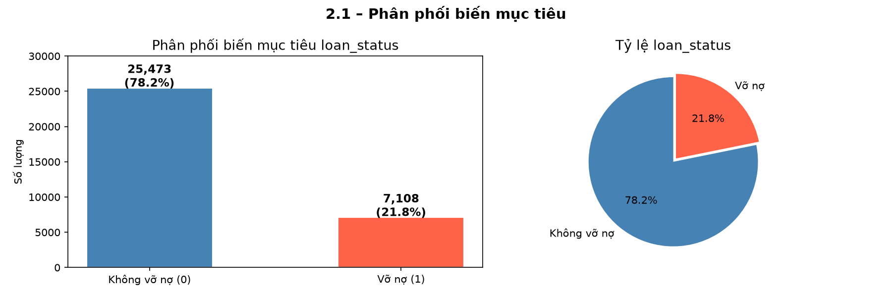
  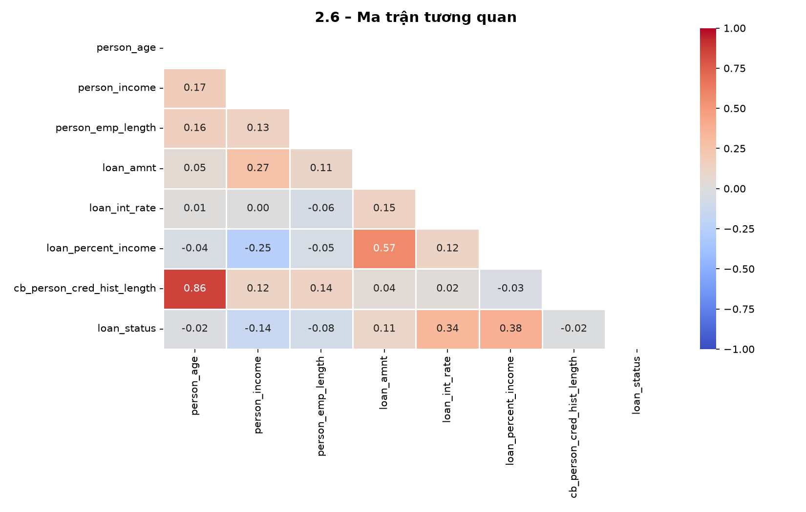
</p>

### 3.2 Phân phối các biến số & phát hiện Outlier
<p align="center">
  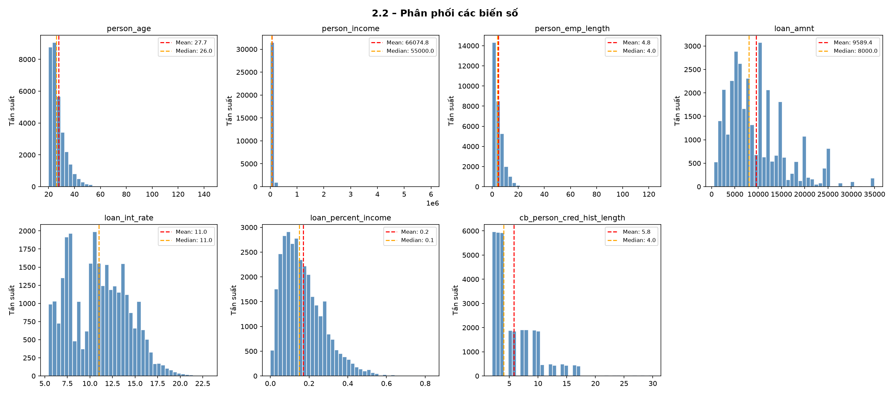
</p>
<p align="center">
  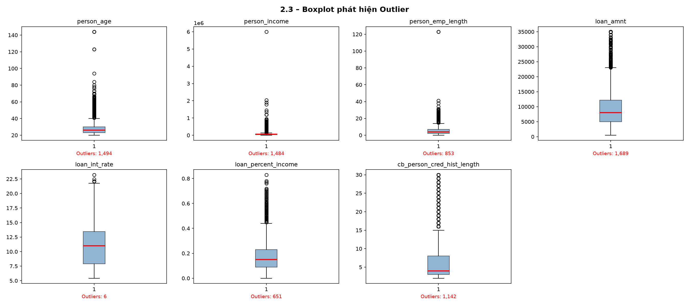
</p>

---

##  4. Tiền xử lý dữ liệu

1. **Lọc Outlier:** Loại bỏ các bản ghi bất thường (`person_age ≥ 80`, `person_emp_length ≥ 60`).
2. **Xử lý Missing Values:** Điền khuyết `loan_int_rate` (~9.56% thiếu) và `person_emp_length` (~2.75% thiếu) bằng giá trị **median**.
3. **Mã hóa biến phân loại (Label Encoding):** `person_home_ownership`, `loan_intent`, `loan_grade`, `cb_person_default_on_file`.
4. **Chuẩn hóa dữ liệu (Feature Scaling):** Dùng `StandardScaler` đưa các thuộc tính số về cùng phân phối chuẩn theo công thức:

$$z = \frac{x - \mu}{\sigma}$$

<p align="center">
  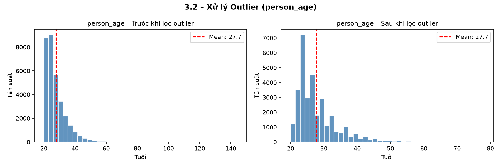
  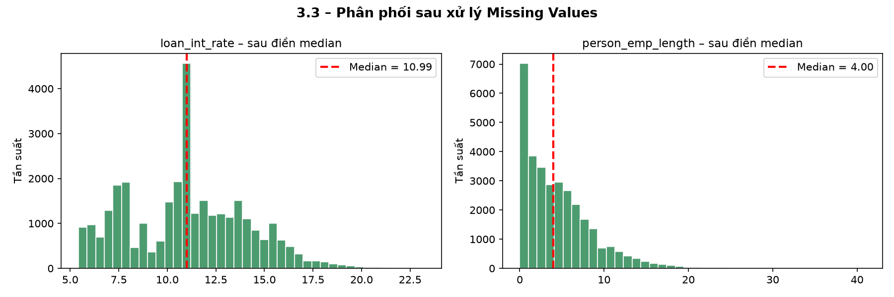
</p>
<p align="center">
  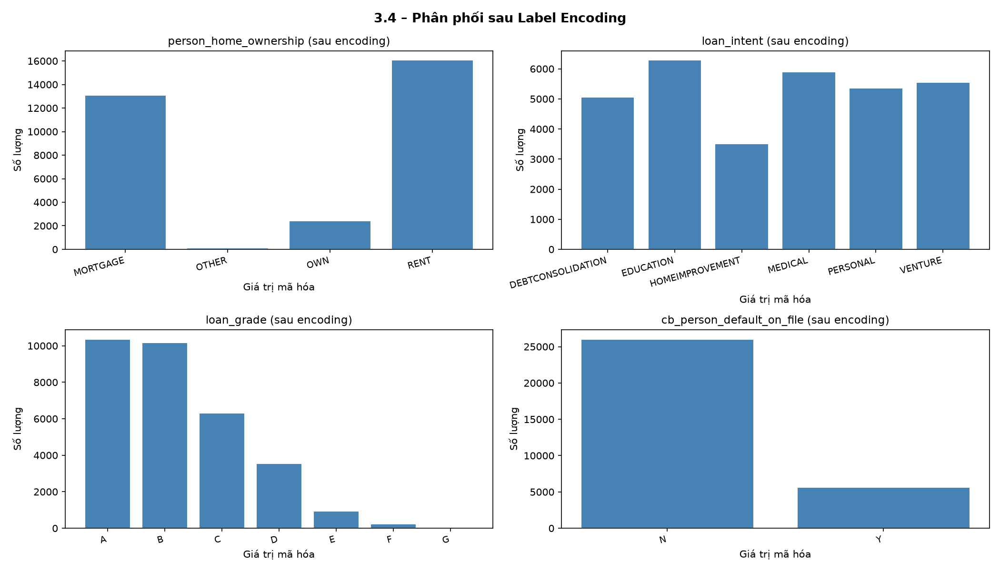
  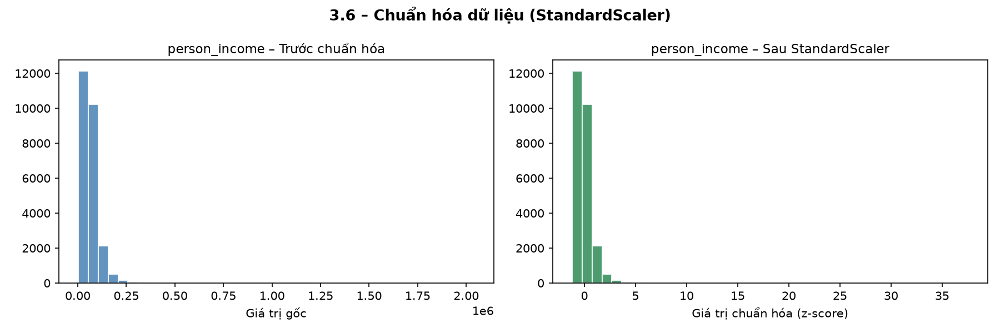
</p>

---

##  5. Đánh giá & Kết quả mô hình

So sánh hiệu năng các thuật toán Ensemble Learning trên tập kiểm thử:

| Mô hình | Accuracy | F1-Score | ROC-AUC |
|---|---|---|---|
| Random Forest | 93.7% | 84.8% | 97.6% |
| **XGBoost** | **94.1%** | **85.3%** | **98.0%** |
| Gradient Boosting | 93.5% | 84.2% | 97.7% |

 **Mô hình tốt nhất: XGBoost** (sau Hyperparameter Tuning) — ROC-AUC đạt **98.0%**

<p align="center">
  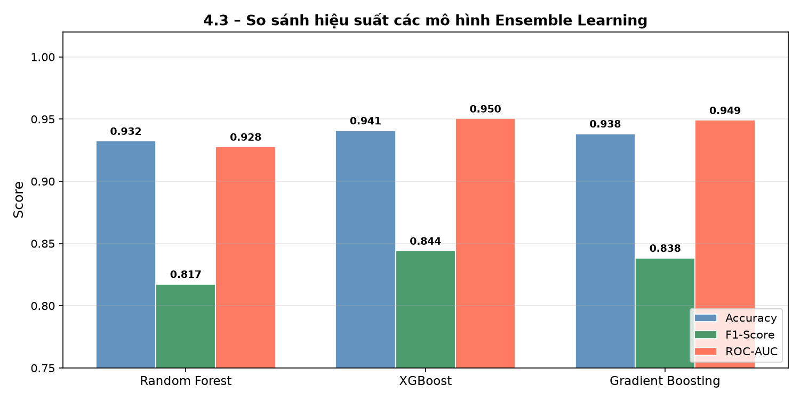
  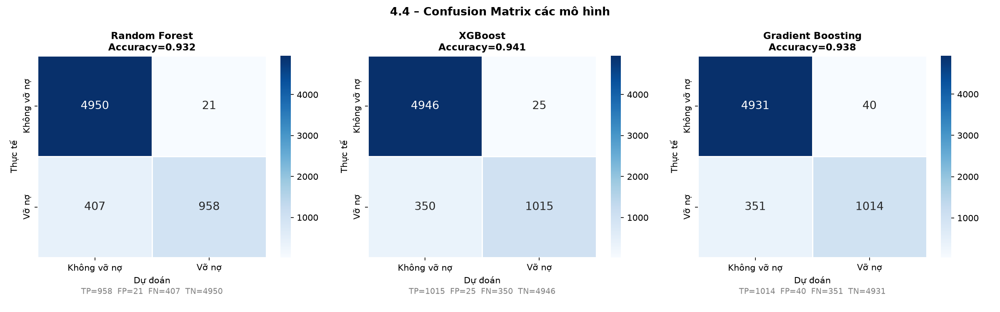
</p>
<p align="center">
  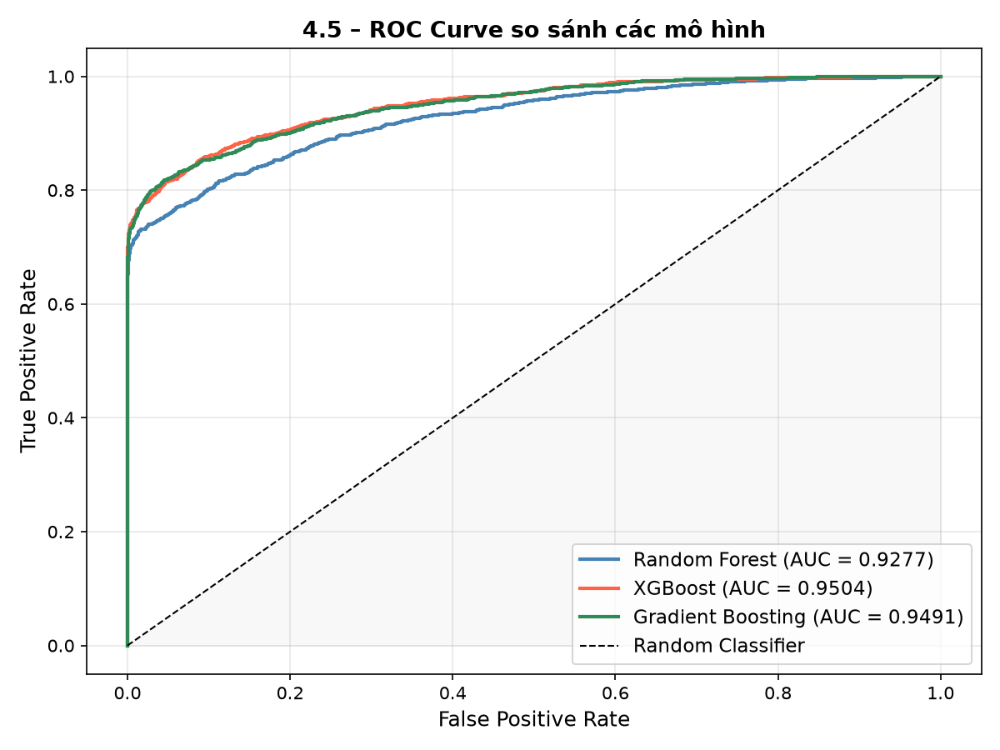
  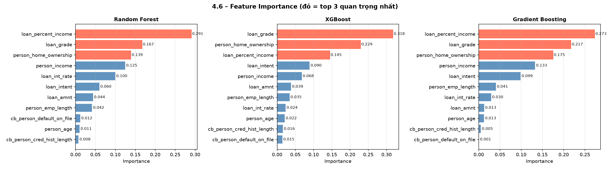
</p>

**Đặc trưng quan trọng nhất:** Tỷ lệ khoản vay/thu nhập (`loan_percent_income`), hạng tín dụng (`loan_grade`) và lãi suất (`loan_int_rate`) là các yếu tố ảnh hưởng lớn nhất đến khả năng vỡ nợ.

---

##  6. Ứng dụng Web Demo (Streamlit)

Hệ thống được đóng gói thành giao diện web trực quan (tông màu Finance Navy) với 3 chức năng chính:

| Chức năng | Mô tả |
|---|---|
|  **Dự đoán đơn lẻ** | Nhập thông tin 1 khách hàng → nhận kết quả dự đoán ngay kèm xác suất rủi ro |
|  **Dự đoán hàng loạt** | Upload file CSV nhiều khách hàng → dự đoán toàn bộ, xuất kết quả |
|  **Thông tin mô hình** | Xem thuật toán, hiệu suất mô hình, thông tin đề tài |

Hệ thống tự động xử lý dữ liệu đầu vào: điền missing values, giới hạn outlier, chuẩn hóa tên/giá trị cột trước khi đưa vào mô hình dự đoán.

---

##  7. Cấu trúc thư mục dự án

```text
├── .streamlit/
│   └── config.toml           # Cấu hình giao diện & theme cho Streamlit
├── data/
│   └── credit_risk_dataset.csv       # Tập dữ liệu gốc (Kaggle)
├── images/                           # Biểu đồ EDA & đánh giá mô hình
│   ├── eda_01_target_distribution.png
│   ├── eda_02_numeric_distributions.png
│   ├── ...
│   ├── pre_01_outlier.png
│   ├── ...
│   └── model_04_feature_importance.png
├── models/
│   ├── best_model.pkl                    # Mô hình tốt nhất đã huấn luyện (XGBoost)
│   ├── scaler.pkl                        # Bộ chuẩn hóa StandardScaler
│   └── feature_names.pkl                 # Danh sách đặc trưng đầu vào
├── notebooks/
│   └── credit-risk-analysis.ipynb                    # Toàn bộ quy trình phân tích, huấn luyện
├── README.md                         # Tài liệu giới thiệu dự án
├── requirements.txt                  # Danh sách thư viện cần thiết
└── web.py                            # Ứng dụng Streamlit dự đoán rủi ro
```

---

##  8. Hướng dẫn chạy dự án

### Bước 1 — Clone repository
```bash
git clone https://github.com/nhaxphuowng1910-code/credit-risk-prediction.git
cd credit-risk-prediction
```

### Bước 2 — Cài đặt môi trường & thư viện
```bash
# Tạo môi trường ảo (tùy chọn)
python -m venv venv
venv\Scripts\activate        # Windows

# Cài đặt thư viện
pip install -r requirements.txt
```

### Bước 3 — Chạy notebook để huấn luyện mô hình
```bash
jupyter notebook notebooks/credit-risk-analysis.ipynb
```
Chạy tuần tự từ Phần 1 → Phần 5 để tạo ra `best_model.pkl`, `scaler.pkl`, `feature_names.pkl`.

### Bước 4 — Chạy ứng dụng web Streamlit
```bash
streamlit run web.py
```
Truy cập trình duyệt tại: `http://localhost:8501`

---

##  9. Hạn chế của hệ thống

- Chỉ nhận đúng schema 11 cột đầu vào cố định, chưa tự thích ứng với dataset khác cấu trúc.
- Mô hình huấn luyện từ dữ liệu giới hạn (~32.000 dòng, 1 nguồn), dữ liệu mất cân bằng lớp.
- Chưa có khả năng giải thích chi tiết từng dự đoán cá nhân (thiếu SHAP/LIME).
- Chạy local, chưa triển khai public, chưa có xác thực người dùng.
- Kết quả chỉ mang tính tham khảo, không thay thế thẩm định tín dụng chuyên môn.

---

##  10. Công nghệ sử dụng

`Python` · `Pandas` · `NumPy` · `Scikit-learn` · `XGBoost` · `Matplotlib` · `Seaborn` · `Streamlit` · `Joblib`

---

<p align="center">© 2026 – Đồ án Chuyên ngành | Khoa Công nghệ Thông tin – Đại học Nguyễn Tất Thành</p>
